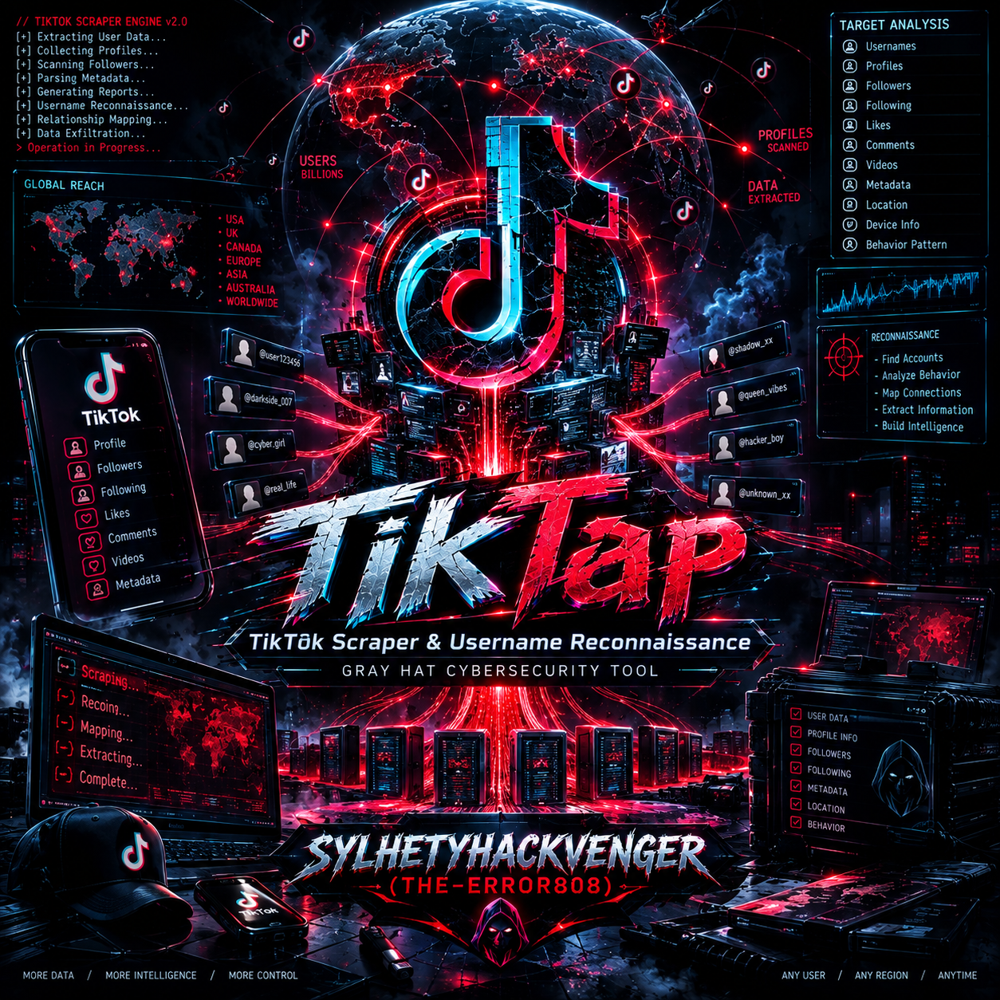

# 🎯 TikTap -TikTok Scraper & Username Reconnaissance 
<p align="center">
  
</p>

<div align="center">
<div align="center">

# TikTap

<p><strong>⚡ TikTap — Project Toolkit</strong></p>


<br>


<br>


</div>


TikTok User Info Scraper & Username Reconnaissance Framework

A strategic OSINT & cybersecurity reconnaissance tool for TikTok profile intelligence gathering, cross-platform username enumeration, and digital footprint analysis.

Features • Installation • Usage • Modules • Reports • Legal

</div>

---

📖 Overview

TikTap is a professional-grade, terminal-based OSINT (Open-Source Intelligence) tool engineered for cybersecurity researchers, penetration testers, digital forensics analysts, and bug bounty hunters. It performs deep reconnaissance on TikTok user profiles and pivots the discovered username across 75+ social platforms, forums, and services to build a comprehensive digital footprint.

Written entirely in pure Bash, TikTap is lightweight, dependency-minimal, and works seamlessly on Termux (Android), Linux, and macOS — no Python, no Node.js, no heavy runtime required.

⚠️ TikTap is built for authorized security research, OSINT investigations, and educational purposes only. See the Legal Disclaimer.

---

✨ Features

🎯 Core Capabilities

Feature Description
🔍 Deep TikTok Profiling Extracts 40+ data points from any public TikTok profile
🌐 Cross-Platform Recon Enumerates the same username across 75+ platforms
🧠 Smart Verdict Engine Confidence-scored found/not-found detection with anti-bot awareness
🕰️ Wayback Machine Lookup Checks Internet Archive for historical snapshots
🔐 TLS Fingerprinting Grabs certificate subject, issuer, and validity dates
📡 DNS Intelligence Resolves IP addresses and performs reverse DNS lookups
🕵️ Dork Generator Builds 60+ Google/Bing/DDG dorks for footprint pivoting
📊 Multi-Format Reports Exports TSV + JSONL reports for further automation
🎨 Beautiful TUI ANSI-powered color interface that works in any terminal

🧬 TikTok Data Extraction

TikTap pulls everything publicly visible on a TikTok profile:

<details>
<summary><b>Click to expand full data schema</b></summary>

Profile Metadata

· id — Numeric TikTok user ID
· uniqueId — Handle / username
· nickname — Display name
· signature — Bio text
· verified / secret — Verification badge status
· privateAccount — Privacy toggle
· ttSeller / ftcUser — Commerce indicators
· language / region — Localization data
· secUid — Internal TikTok API token
· roomId — Live room identifier
· commerceUserInfo — Business account data
· bioLink — External link in bio

Statistics

· followerCount — Followers
· followingCount — Following
· heartCount — Total likes received
· videoCount — Public video count
· friendCount — Mutual friends
· diggCount — Videos liked

Timelines (Unix → Human Readable)

· createTime — Account creation date
· uniqueIdModifyTime — Last username change
· nickNameModifyTime — Last nickname change
· signatureModifyTime — Last bio update
· avatarModifyTime — Last avatar change

Privacy & Settings

· commentSetting, duetSetting, stitchSetting
· openFavorite, isADVirtual, isEmbedBanned

Obfuscated Credentials

· csrfToken, _signature, verifyFp, odnFp

Session Cookies (from live request)

· ttwid, tt_webid, s_v_web_id, msToken, webid
· sessionid, sessionid_ss, sid_tt
· uid_tt, uid_tt_ss, sid_guard
· passport_csrf_token, csrf_session_id

JS Bundle & SDK

· webmssdkVersion — TikTok signature SDK version
· webapp.version — Web app version
· webapp.obfuscated — Obfuscation hash

Response Headers

· server, date, content-type
· x-tt-logid, x-tt-trace-id, x-tt-timing, x-tt-region

Engagement Data (per post)

· Post ID, caption, views, likes, comments, shares, saves, duration, timestamp

Social Graph

· Top 10 followers (with bio + verification)
· Top 10 following (with bio + verification)
· Top 5 comments on latest video

</details>

🌍 Cross-Platform Enumeration (75+ Sites)

<details>
<summary><b>Click to expand full platform list</b></summary>

Social Networks:
Instagram • X (Twitter) • Facebook • LinkedIn • Snapchat • Reddit • Pinterest • Tumblr • VK • Odnoklassniki • Mastodon • Threads • Bluesky • Clubhouse

Creator & Media:
YouTube • Twitch • Medium • Flickr • Vimeo • SoundCloud • Spotify • DeviantArt • Behance • Dribbble • Quora

Messaging:
Telegram • Discord • Signal • WhatsApp • Skype • Viber • Line • Kakao • WeChat • Messenger • imo

Gaming:
Steam • Roblox

Chinese Platforms:
Weibo • Douyin • Kuaishou • Bilibili

Live Streaming:
Bigo Live • Likee • Poppo Live • Kwai • Chamet • OmeTV

Bangladeshi / South Asian:
Bongo • Toot • Vibe • Nagad Social • Moj • Toki • Helo • ShareChat • Kukie • Nimbuzz

Support & Donations:
Patreon • Ko-fi • BuyMeACoffee • Meetup • Eventbrite • Goodreads • Last.fm • Mixcloud • Bandcamp • Zoom

…and many more.

</details>

🛡️ Intelligent Verdict Engine

TikTap uses a multi-signal scoring algorithm — not naive string matching:

· HTTP status code analysis (200/404/403/429)
· Anti-bot detection (Cloudflare, DataDome, PerimeterX, hCaptcha)
· SPA shell detection (empty <meta> = JS-rendered app)
· OpenGraph / Twitter Card metadata extraction
· Generic title filtering (ignores "Login", "Sign Up", "Not Found")
· Body marker validation (tgme_page_title, "login", custom markers)
· Confidence tiers: HIGH / MEDIUM / LOW
· Score: 0–100 based on accumulated signals

Verdicts: found • maybe • blocked • rate_limited • not_found • unknown

🕵️ Dork Generator

Automatically generates 60+ search dorks for pivoting the username across the indexed web:

```
site:instagram.com "username"
site:x.com "username"
site:github.com "username"
"username" bio
"username" email
"username" phone
"username" filetype:pdf
"username" filetype:doc OR filetype:docx
"username" leak
"username" "data leak"
"username" pastebin
"username" inurl:profile
"username" intitle:"username"
...and 50+ more
```

Optionally fetches live results from DuckDuckGo, Bing, or Google.

---

🚀 Installation

Prerequisites

TikTap requires the following CLI tools — most are pre-installed on modern systems:

```bash
curl jq awk grep sed fold tput wc sort cut tr head tail date
```

One-liner install (Debian / Ubuntu / Kali)

```bash
sudo apt update && sudo apt install -y curl jq coreutils gawk grep sed util-linux
```

Termux (Android)

```bash
pkg update && pkg upgrade -y
pkg install -y curl jq coreutils gawk grep sed termux-tools openssl
```

macOS (Homebrew)

```bash
brew install curl jq coreutils gnu-sed gawk
```

Arch Linux

```bash
sudo pacman -S --needed curl jq coreutils gawk grep sed util-linux openssl
```

Get TikTap

```bash
# Clone the repository
git clone https://github.com/sylhetyhackvenger/tiktap.git
cd tiktap

# Make it executable
chmod +x tiktap.sh

# Run it
./tiktap.sh
```

Quick Install (one-liner)

```bash
curl -sL https://raw.githubusercontent.com/sylhetyhackvenger/tiktap/main/tiktap.sh -o tiktap.sh && chmod +x tiktap.sh && ./tiktap.sh
```

---

🎮 Usage

Interactive Mode

```bash
./tiktap.sh
```

You'll be greeted with a stylish prompt:

```
  +-[ TARGET ]
  |
  |  Enter TikTok username (no @ needed)
  |  > 
  +--------------------------------------------------
```

Direct Target Mode

```bash
./tiktap.sh username
./tiktap.sh @username
```

Environment Variables

TikTap is fully configurable via environment variables:

Variable Default Description
SITES_FILE sites.json Cross-platform target list
CROSS_TIMEOUT 12 Per-site timeout (seconds)
CROSS_CONCURRENCY 6 Parallel workers
CROSS_RETRY 2 Retry attempts on failure
CROSS_WAYBACK 1 Enable Wayback Machine lookup (0/1)
CROSS_TLS 1 Enable TLS certificate probe (0/1)
CROSS_DNS 1 Enable DNS/PTR probe (0/1)
CROSS_REPORT_TSV cross_report.tsv TSV report output path
CROSS_REPORT_JSONL cross_report.jsonl JSONL report output path
DORK_ENGINE duckduckgo duckduckgo / bing / google
DORK_MAX_RESULTS 10 Results per dork
DORK_FETCH 1 Actually fetch dork results
DORK_SLEEP 1 Delay between dork queries

Example: aggressive scan

```bash
CROSS_CONCURRENCY=20 CROSS_TIMEOUT=8 CROSS_RETRY=3 ./tiktap.sh target
```

Example: stealth scan (no dorks, no external fetches)

```bash
DORK_FETCH=0 CROSS_WAYBACK=0 CROSS_TLS=0 CROSS_DNS=0 ./tiktap.sh target
```

---

🧩 Modules

Module 1 — TikTok Profile Extraction

Sends a hardenend request with randomized User-Agent and Accept-Language headers, uses a cookie jar to capture live session tokens, and extracts profile JSON from the embedded <script> tags.

· Rotates through 9 realistic browser UAs
· Uses 4 different Accept-Language locales
· Auto-detects and warns on BusyBox/Brotli-less curl
· Extracts webmssdk.js and webapp.js bundle versions

Module 2 — Cross-Site Username Reconnaissance

Fans out N parallel workers (CROSS_CONCURRENCY) across all sites in sites.json. Each worker:

1. Fetches the templated URL with retry/backoff
2. Detects anti-bot interstitials
3. Runs the verdict engine
4. Enriches with API-level scrapers (Instagram, Twitter, YouTube, Reddit, Telegram, Bilibili, Roblox, etc.)
5. Queries Wayback Machine
6. Probes TLS certificate
7. Resolves DNS + reverse PTR
8. Emits a TSV line + JSONL object

Module 3 — API Scrapers

For high-value platforms, dedicated scrapers bypass generic HTML parsing:

Platform Method
Instagram i.instagram.com/api/v1/users/web_profile_info with X-IG-App-ID
X (Twitter) syndication.twitter.com/srv/timeline-profile
YouTube Parse channelMetadataRenderer + subscriberCountText
Reddit /user/{u}/about.json
Telegram t.me/s/{u} + tgme_page_* markers
Pinterest /resource/UserResource/get/
Bilibili Search API → web-interface/card?mid=
Roblox users.roblox.com/v1/usernames/users + thumbnails API
Snapchat OG meta + subscriberCount regex

Module 4 — Internet Footprint Dorks

Generates a categorized dork list and optionally runs live queries:

```
[ PERSONAL ]
"username" bio
"username" biodata
"username" about me
"username" birthday
"username" anniversary

[ CONTACT ]
"username" email
"username" phone
"username" address
"username" location

[ DOCUMENTS ]
"username" filetype:pdf
"username" filetype:doc OR filetype:docx
"username" filetype:xls OR filetype:xlsx
"username" filetype:sql
"username" filetype:json

[ LEAKS ]
"username" leak
"username" "data leak"
"username" pastebin

[ SOCIAL ]
site:instagram.com "username"
site:x.com "username"
site:github.com "username"
...
```

Module 5 — Raw Report Export

Optionally dumps all gathered intelligence to a structured .txt file:

```
============================================================
 TikTap - TikTok Scraper & Username Reconnaissance
 Author : SYLHETYHACKVENGER (THE-ERROR808)
 GitHub : sylhetyhackvenger
 Target : @username
 Date   : 2025-01-15 12:34:56 UTC
============================================================

[ PROFILE ]
User ID               : 1234567890
Username              : @username
Nickname              : Real Name
Verified              : yes
Private               : no
...

[ STATS ]
Followers             : 125000 (125.00K)
Following             : 340 (340)
Likes                 : 2500000 (2.50M)
...

[ TIMELINE ]
Account Created       : 2019-03-22 08:14:11
Username Changed      : 2023-07-10 14:22:05
...
```

---

📊 Reporting

TikTap produces three machine-readable output files during every scan:

1. cross_report.tsv — Human-readable tab-separated table

```
NAME                 HTTP   VERDICT       CONF   SCORE  METHOD   TIME   REDIR  IP              PROFILE_NAME       JOINED       FOLLOWERS
Instagram            200    found         HIGH   90     api      0.842  0      157.240.x.x     John Doe           2015-06-01   12400
GitHub               200    found         HIGH   90     api      0.512  0      140.82.x.x      johndoe            2014-02-11   340
Telegram             200    found         HIGH   90     tgme     1.203  0      149.154.x.x     John Doe           2018-01-20   5200
X (Twitter)          200    maybe         MEDIUM 50     meta     0.641  0      104.244.x.x     John Doe           -            -
Cloudflare-Site      403    blocked       LOW    0      body     0.301  0      104.18.x.x      -                  -            -
...
```

2. cross_report.jsonl — Line-delimited JSON (one object per site)

```json
{
  "name": "GitHub",
  "url": "https://api.github.com/users/johndoe",
  "http": "200",
  "verdict": "found",
  "confidence": "HIGH",
  "score": 90,
  "method": "api",
  "response_time": "0.512",
  "redirects": "0",
  "remote_ip": "140.82.x.x",
  "server": "GitHub.com",
  "x_powered_by": "",
  "body_hash": "a3f5...",
  "spa_shell": "no",
  "antibot": "no",
  "dns_ip": "140.82.x.x",
  "dns_reverse": "lb-140-82-112-3-iad.github.com",
  "tls": "subject=CN=github.com|issuer=...|notBefore=...|notAfter=...",
  "redirect_chain": "",
  "profile_name": "John Doe",
  "bio": "Full-stack developer",
  "avatar": "https://avatars.githubusercontent.com/u/12345",
  "joined": "2014-02-11T08:14:00Z",
  "followers": "340",
  "wayback_timestamp": "20240315123456",
  "wayback_url": "http://web.archive.org/web/20240315123456/https://github.com/johndoe",
  "reason": "api_key"
}
```

3. cross_report.err — Worker stderr capture

Any errors, timeouts, or jq parse failures are logged here for debugging.

4. <username>.txt — Full raw intelligence dump

Written only when you answer y to the save prompt. Includes every extracted field, plus all cross-site results and the full dork list.

---

🏗️ Architecture

```
tiktap.sh
│
├── Bootstrap Layer
│   ├── Locale detection (UTF-8 fallback)
│   ├── Dependency checker
│   └── ANSI color definitions
│
├── UI Layer
│   ├── banner()          — ASCII logo
│   ├── section()         — Colored section headers
│   ├── row()             — Key/value renderer with wrapping
│   ├── para()            — Multi-line paragraph renderer
│   ├── top_border()      — Box drawing
│   └── prompt_user()     — Interactive input
│
├── TikTok Extraction Layer
│   ├── fetch_and_parse() — HTML fetch + regex extraction
│   ├── extract()         — grep-based field extractor
│   ├── cookie_val()      — Cookie jar parser
│   └── header_val()      — Response header parser
│
├── Cross-Platform Layer
│   ├── _cross_fetch_full()   — HTTP fetch + metadata
│   ├── _cross_verdict_v2()   — Scoring engine
│   ├── _cross_worker_v2()    — Parallel worker
│   ├── _enrich_from_body()   — Profile enrichment
│   └── _scrape_*()           — 11 platform-specific scrapers
│
├── Recon Probes
│   ├── _dns_probe()      — DNS + reverse lookup
│   ├── _tls_probe()      — X.509 certificate
│   └── _wayback_probe()  — Internet Archive
│
├── Dork Layer
│   ├── build_dorks()     — 60+ dork templates
│   └── run_dork_engine() — Live search fetch
│
└── Reporting Layer
    ├── save_raw()        — Full text dump
    └── cross_check_username() — Summary + sort
```

---

⚡ Performance

Metric Value
Base scan time ~8–15 seconds
Cross-site (75 platforms, concurrency=6) ~45–90 seconds
Full scan + dorks ~2–4 minutes
Memory footprint < 20 MB
Disk (reports) ~200 KB per scan

Tune CROSS_CONCURRENCY higher on fast connections:

· 6 — Safe default
· 12 — Fast (may trigger rate limits)
· 20 — Aggressive (recommended for VPS only)

---

🧪 Example Output

```


  ###  T i k T a p  ###
  TikTok User Info Scraper  |  TikTok Scraper & Username Reconnaissance
  github.com/sylhetyhackvenger

+================================================================================+
| [ PROFILE ]-------------------------------------------------------------------|
| * User ID              : 1234567890123456                                    |
| * Username             : @targetuser                                         |
| * Nickname             : Target User                                         |
| * Verified             : yes                                                 |
| * Private              : no                                                  |
| * TikTok Seller        : no                                                  |
| * Language             : English                                             |
| * Region               : United States                                       |
| * SecUid               : MS4wLjABAAAA...                                     |
| * Bio Link             : https://example.com                                 |
| * Room ID              : 7123456789012345678                                 |
+--------------------------------------------------------------------------------+
| [ STATS ]---------------------------------------------------------------------|
| * Followers            : 1250000  (1.25M)                                    |
| * Following            : 340  (340)                                          |
| * Likes                : 25000000  (25.00M)                                  |
| * Videos               : 412  (412)                                          |
+--------------------------------------------------------------------------------+
| [ CROSS-SITE USERNAME RECON ]-------------------------------------------------|
| * Instagram            : FOUND [HIGH/90] 0.842s  name:Target User            |
| * GitHub               : FOUND [HIGH/90] 0.512s  since:2014-02-11            |
| * Telegram             : FOUND [HIGH/90] 1.203s  followers:5200              |
| * X (Twitter)          : maybe [MEDIUM/50]                                    |
| * Facebook             : blocked (anti-bot)                                  |
| * YouTube              : FOUND [HIGH/90] 1.551s  followers:2.4M              |
| ...                                                                          |
+--------------------------------------------------------------------------------+
| * FOUND                : 34                                                   |
| * Maybe                : 12                                                   |
| * Blocked              : 8                                                    |
| * Rate-limited         : 2                                                    |
| * Not found            : 19                                                   |
+================================================================================+
```

---

🔧 Troubleshooting

curl: option --compressed: is unknown

Your curl lacks Brotli support (common on BusyBox). TikTap warns you and retries without compression automatically.

jq: command not found

```bash
pkg install jq     # Termux
sudo apt install jq  # Debian/Ubuntu
brew install jq    # macOS
```

Cross-site scans return all unknown

Likely your ISP or network is rate-limiting. Try:

```bash
CROSS_CONCURRENCY=2 CROSS_RETRY=3 CROSS_TIMEOUT=20 ./tiktap.sh target
```

TikTok returns 404 / empty

TikTok aggressively blocks datacenter IPs. Use a residential connection, or rotate your IP. TikTap already rotates User-Agents and languages.

Wayback / TLS probes slow down scans

Disable them:

```bash
CROSS_WAYBACK=0 CROSS_TLS=0 CROSS_DNS=0 ./tiktap.sh target
```

---

🛡️ Legal Disclaimer

TikTap is provided for educational, authorized security research, and legitimate OSINT investigations only.

By using this tool, you agree that:

1. You will only use it against targets you own or have explicit written permission to test.
2. You will comply with all applicable local, national, and international laws, including but not limited to:
   · Computer Fraud and Abuse Act (CFAA) — USA
   · Computer Misuse Act — UK
   · GDPR — EU
   · Bangladesh Digital Security Act
   · Any equivalent legislation in your jurisdiction.
3. You will not use TikTap for stalking, harassment, doxxing, or any form of unauthorized surveillance.
4. You will not use it for commercial scraping without the explicit consent of the data subject.
5. The author assumes no liability for misuse, legal consequences, or damages arising from the use of this tool.

TikTap only accesses publicly available information. It does not bypass authentication, exploit vulnerabilities, or access private data.

If you are unsure whether your use case is legal, consult a lawyer before running it.

---

🤝 Contributing

Contributions are welcome! Here's how:

1. Fork the repository
2. Create a feature branch: git checkout -b feature/amazing-feature
3. Commit your changes: git commit -m 'Add amazing feature'
4. Push: git push origin feature/amazing-feature
5. Open a Pull Request

Ideas for Contributions

☐ Add more platforms to sites.json
☐ Improve verdict engine heuristics
☐ Add PDF/HTML report exporters
☐ Add proxy/Tor support
☐ Add profile picture hashing + reverse image search
☐ Add email/phone pivot modules
☐ Add CSV export
☐ i18n / multi-language UI

---

📜 Changelog

v2.0 — Current

· ✨ Intelligent verdict engine with confidence scoring
· ✨ Anti-bot detection (Cloudflare, DataDome, PerimeterX)
· ✨ 11 platform-specific API scrapers
· ✨ Wayback Machine, TLS, and DNS probes
· ✨ JSONL + TSV dual reporting
· ✨ 75+ cross-platform targets
· ✨ 60+ dork templates with live fetch

v1.0 — Initial Release

· TikTok profile extraction
· Basic cross-site check
· ANSI TUI

---

📄 License

Distributed under the MIT License. See LICENSE for details.

```
MIT License

Copyright (c) 2025 SYLHETYHACKVENGER (THE-ERROR808)

Permission is hereby granted, free of charge, to any person obtaining a copy
of this software and associated documentation files (the "Software"), to deal
in the Software without restriction, including without limitation the rights
to use, copy, modify, merge, publish, distribute, sublicense, and/or sell
copies of the Software, and to permit persons to whom the Software is
furnished to do so, subject to the following conditions:

The above copyright notice and this permission notice shall be included in all
copies or substantial portions of the Software.

THE SOFTWARE IS PROVIDED "AS IS", WITHOUT WARRANTY OF ANY KIND.
```

---

👤 Author

<div align="center">

SYLHETYHACKVENGER (THE-ERROR808)

https://img.shields.io/badge/GitHub-sylhetyhackvenger-181717?style=for-the-badge&logo=github

Cybersecurity Researcher • OSINT Enthusiast • Ethical Hacker

</div>

---

⭐ Show Your Support

If TikTap helped your research, please consider:

· ⭐ Starring the repository
· 🐛 Reporting bugs via Issues
· 💡 Suggesting features
· 📢 Sharing with the cybersecurity community

---

<div align="center">

⚠️ USE RESPONSIBLY — HACK THE PLANET, NOT PEOPLE'S LIVES ⚠️

```
    "With great power comes great responsibility."
                        — Uncle Ben
```

Made with 💙 by SYLHETYHACKVENGER

</div>
